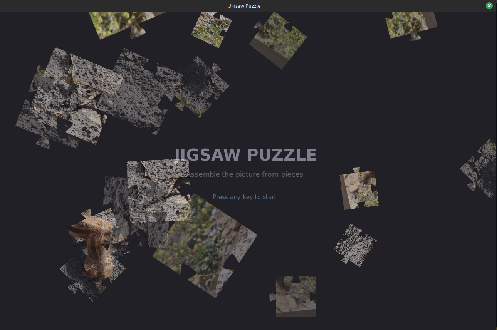
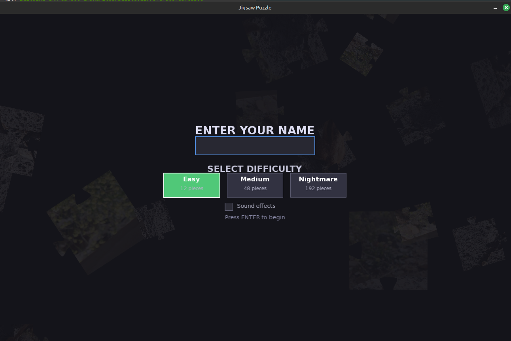
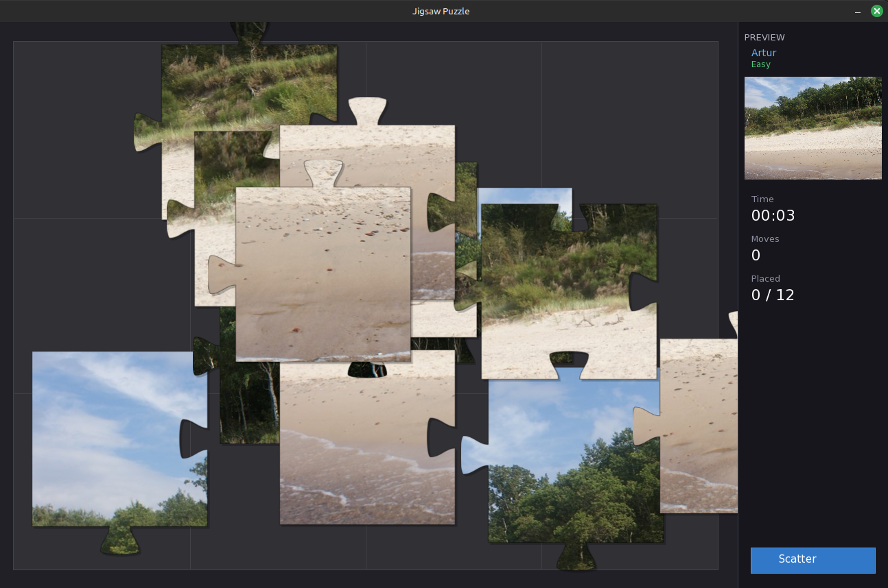
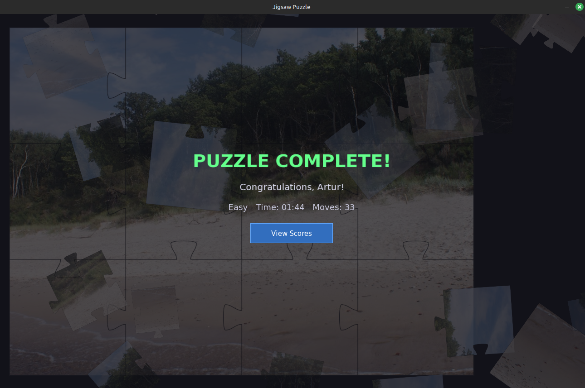
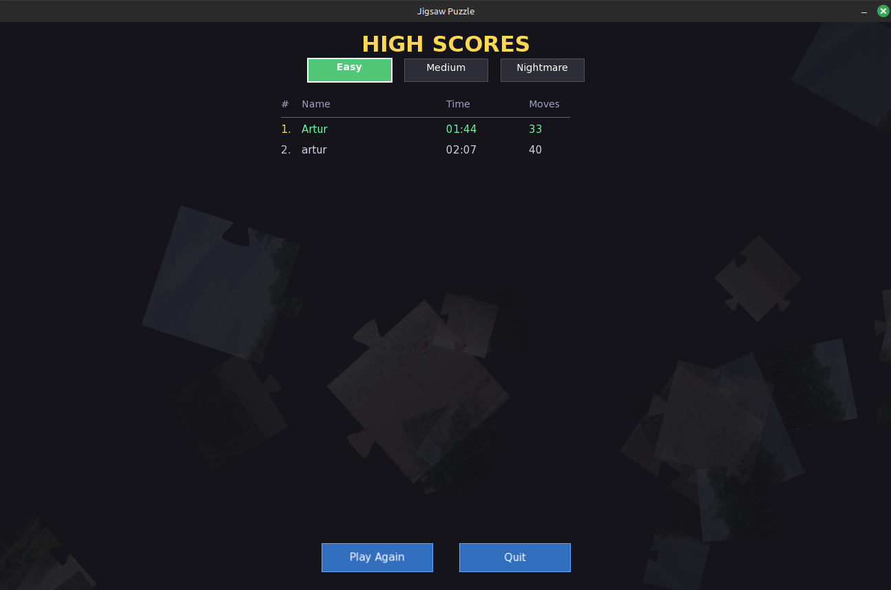

# Jigsaw Puzzle Game

A desktop jigsaw puzzle game built with **SFML 2.5** and **Cairo**, featuring animated screens, sound effects, difficulty levels, persistent high scores, and a hidden cheat code.


## Features

- **Classic jigsaw pieces** with interlocking tabs and blanks rendered via Cairo Bezier curves
- **3 difficulty levels**: Easy (4x3 = 12 pieces), Medium (8x6 = 48 pieces), Nightmare (16x12 = 192 pieces)
- **Animated intro** with floating puzzle pieces
- **Drag & drop** gameplay with snap-to-grid and drop shadows
- **Sound effects** (toggleable): snap on correct placement, buzz on incorrect drop, fanfare on completion
- **Sound toggle checkbox** on the name/difficulty screen (off by default)
- **Self-contained binary**: all images and sounds are embedded at compile time — no external resource files needed
- **Persistent high scores** saved to `scores.txt`, filterable by difficulty
- **Random image selection** from bundled image packs (36 kids + 1 adult)
- **Hidden adult image mode** via cheat code (see below)
- **Sidebar UI** with preview thumbnail, timer, move counter, and piece tracker

## Demo Video

[**Watch on YouTube**](https://youtu.be/t4rRS58Bd6s)

[](https://youtu.be/t4rRS58Bd6s)

## Screenshots

The game progresses through 5 screens:

| Intro | Name & Difficulty | Gameplay |
|:---:|:---:|:---:|
|  |  |  |

| Win Screen | High Scores |
|:---:|:---:|
|  |  |

## Dependencies

| Library | Version | Purpose |
|---------|---------|---------|
| [SFML](https://www.sfml-dev.org/) | >= 2.5 | Windowing, rendering, audio |
| [Cairo](https://www.cairographics.org/) | >= 1.16 | Puzzle piece shape rendering |
| CMake | >= 3.16 | Build system |
| pkg-config | any | Cairo detection |

### Installing dependencies

**Ubuntu / Debian:**
```bash
sudo apt-get install libsfml-dev libcairo2-dev cmake pkg-config
```

**Arch Linux:**
```bash
sudo pacman -S sfml cairo cmake pkgconf
```

**Fedora:**
```bash
sudo dnf install SFML-devel cairo-devel cmake pkg-config
```

## Building

```bash
git clone <repository-url>
cd puzzle
mkdir build && cd build
cmake ..
make -j$(nproc)
```

All images and sounds from `RES/` are embedded into the binary at compile time via a Python code generator (`cmake/embed_resources.py`). The resulting binary is fully self-contained.

## Running

Copy the binary anywhere and run it:

```bash
./puzzle
```

No external resource files are needed — everything is baked into the executable.

## How to Play

1. **Intro screen** - Press any key or click to skip
2. **Enter your name** - Type your name (max 16 characters)
3. **Select difficulty** - Click Easy / Medium / Nightmare
4. **Press Enter** to start the game
5. **Drag pieces** with the mouse and drop them near their correct position
6. Pieces **snap into place** when close enough (green glow + sound)
7. Wrong placements play an error sound
8. Complete the puzzle to see your time and score
9. **View Scores** to see the leaderboard, filterable by difficulty
10. **Play Again** to start a new round with a different random image

### Controls

| Action | Input |
|--------|-------|
| Skip intro | Any key / mouse click |
| Type name | Keyboard |
| Delete character | Backspace |
| Start game | Enter |
| Pick up piece | Left click on piece |
| Drop piece | Release left mouse |
| Scatter pieces | Click "Scatter" button |

## Cheat Code

To unlock the **adult image pack**, include the word `adult` anywhere in your name when entering it. The keyword is **case-insensitive** and will be **automatically stripped** from your displayed name and saved scores.

**Examples:**

| You type | Displayed name | Image pack |
|----------|---------------|------------|
| `John` | John | Kids |
| `adultJohn` | John | Adults |
| `MyAdultName` | MyName | Adults |
| `adult` | Player | Adults |

A red `* Adult mode activated *` indicator appears below the name input when the cheat code is detected.

## Project Structure

```
puzzle/
├── CMakeLists.txt              # Build configuration
├── README.md                   # This file
├── cmake/
│   └── embed_resources.py      # Compile-time resource embedding generator
├── RES/                        # Source resources (embedded at build time)
│   ├── img_kids/               # Kids image pack (default, 36 images)
│   ├── img_adults/             # Adult image pack (cheat code, 1 image)
│   └── sounds/
│       ├── Gnoop.wav           # Correct placement sound
│       ├── INCORREC.WAV        # Incorrect placement sound
│       └── SUCCESS.WAV         # Puzzle completion fanfare
└── src/
    ├── main.cpp                # Game loop and state machine
    ├── constants.h             # Global configuration values
    ├── types.h                 # Core data types and enumerations
    ├── image_scanner.h/.cpp    # Image discovery from embedded resources
    ├── puzzle_renderer.h/.cpp  # Cairo-based piece shape rendering
    ├── puzzle_generator.h/.cpp # Grid generation and piece creation
    ├── helpers.h/.cpp          # Utilities (formatting, cheat code, RNG)
    ├── scores.h/.cpp           # High score persistence
    ├── flying_pieces.h/.cpp    # Floating piece animations
    └── ui.h/.cpp               # Reusable UI drawing helpers
```

At build time, `cmake/embed_resources.py` converts all files in `RES/` into C++ byte arrays that are compiled directly into the binary. The generated files are placed in `build/generated/`.

## Score File Format

Scores are stored in `scores.txt` as pipe-delimited records:

```
name|timeSec|moves|difficulty
```

Where `difficulty` is `0` (Easy), `1` (Medium), or `2` (Nightmare).

## Adding Custom Images

Place `.png`, `.jpg`, `.jpeg`, or `.bmp` files into:
- `RES/img_kids/` for the default image pack
- `RES/img_adults/` for the cheat-code image pack

Then **rebuild** the project — CMake will detect new files and re-embed them into the binary. A random image is selected from the appropriate pack each time a game starts. Images can be any size; pieces are computed proportionally.

## License

This project is provided as-is for educational purposes.
